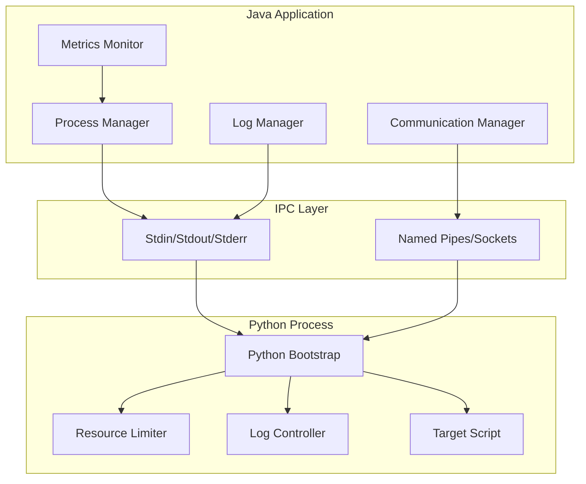

# Design Document

## Overview

The Java-Python Process Manager is a comprehensive system that enables Java applications to create, monitor, and communicate with Python processes. The architecture follows a layered approach with clear separation of concerns: process management, communication, monitoring, and resource control.

The system consists of three main components:
1. **Java Process Manager** - Handles process creation, lifecycle management, and monitoring
2. **Communication Layer** - Manages bidirectional data exchange between Java and Python
3. **Python Bootstrap** - Provides controlled execution environment for Python scripts

## Architecture



## Components and Interfaces

### 1. Process Manager (Java)

**Core Class: `PythonProcessManager`**

```java
public class PythonProcessManager {
    public ProcessHandle createProcess(String scriptPath, Map<String, String> args);
    public ProcessStatus getProcessStatus(ProcessHandle handle);
    public boolean isProcessAlive(ProcessHandle handle);
    public void terminateProcess(ProcessHandle handle, Duration timeout);
    public ProcessMetrics getProcessMetrics(ProcessHandle handle);
}
```

**Responsibilities:**
- Process creation using ProcessBuilder with pythonBootstrap.py
- Health monitoring and status tracking
- Graceful and forceful process termination
- Resource usage metrics collection

### 2. Communication Manager (Java)

**Core Class: `ProcessCommunicationManager`**

```java
public class ProcessCommunicationManager {
    public void sendMessage(ProcessHandle handle, Object data);
    public <T> T receiveMessage(ProcessHandle handle, Class<T> type);
    public void establishChannel(ProcessHandle handle);
    public void closeChannel(ProcessHandle handle);
}
```

**Communication Protocol:**
- JSON-based message serialization for cross-language compatibility
- Named pipes (Windows) or Unix domain sockets (Linux/macOS) for high-performance IPC
- Message framing with length prefixes to handle partial reads
- Heartbeat mechanism for connection health monitoring

### 3. Log Manager (Java)

**Core Class: `ProcessLogManager`**

```java
public class ProcessLogManager {
    public void startLogCollection(ProcessHandle handle);
    public Stream<LogEntry> getLogStream(ProcessHandle handle);
    public void configureLogLevel(ProcessHandle handle, LogLevel level);
    public void stopLogCollection(ProcessHandle handle);
}
```

**Log Processing:**
- Separate threads for stdout/stderr stream processing
- Structured log parsing with timestamp and level extraction
- Integration with Java logging frameworks (SLF4J/Logback)
- Circular buffer for log retention and memory management

### 4. Python Bootstrap (pythonBootstrap.py)

**Core Functions:**
```python
def setup_resource_limits(memory_mb: int, cpu_percent: float):
    """Configure process resource constraints"""

def configure_logging(log_level: str, log_format: str):
    """Set up Python logging with custom handlers"""

def establish_communication():
    """Initialize IPC channel with Java process"""

def load_and_execute_script(script_path: str, args: dict):
    """Dynamically load and run target Python script"""

def cleanup_and_exit(exit_code: int):
    """Perform cleanup before process termination"""
```

**Bootstrap Workflow:**
1. Parse command line arguments (script path, resource limits, communication config)
2. Set up resource limits using `resource` module
3. Configure logging with custom handlers for Java integration
4. Establish communication channel with parent Java process
5. Load target Python script dynamically
6. Execute script with proper error handling
7. Report execution status and perform cleanup

## Data Models

### ProcessStatus
```java
public enum ProcessStatus {
    STARTING, RUNNING, COMPLETED, FAILED, TERMINATED, UNRESPONSIVE
}
```

### ProcessMetrics
```java
public class ProcessMetrics {
    private long cpuTimeMillis;
    private long memoryUsageBytes;
    private long peakMemoryUsageBytes;
    private Duration executionTime;
    private Instant lastHeartbeat;
}
```

### LogEntry
```java
public class LogEntry {
    private Instant timestamp;
    private LogLevel level;
    private String message;
    private String source; // stdout/stderr
    private Map<String, Object> metadata;
}
```

### CommunicationMessage
```java
public class CommunicationMessage {
    private String messageId;
    private String messageType;
    private Object payload;
    private Instant timestamp;
}
```

## Error Handling

### Process Creation Errors
- **Python executable not found**: Validate Python installation and provide clear error message
- **Script file not found**: Check file existence and permissions before process creation
- **Resource allocation failure**: Handle insufficient system resources gracefully

### Runtime Errors
- **Process crash detection**: Monitor process exit codes and capture crash dumps
- **Communication timeout**: Implement exponential backoff retry with circuit breaker pattern
- **Resource limit exceeded**: Graceful termination with cleanup and status reporting
- **Log stream overflow**: Implement backpressure handling and log rotation

### Recovery Strategies
- **Process restart**: Configurable automatic restart for critical processes
- **Communication reconnection**: Automatic channel re-establishment after failures
- **Resource cleanup**: Ensure proper cleanup of file handles, sockets, and memory

## Testing Strategy

### Unit Testing
- **Process Manager**: Mock ProcessBuilder and test process lifecycle operations
- **Communication Manager**: Test message serialization/deserialization and error handling
- **Log Manager**: Verify log parsing and stream processing with various input formats
- **Python Bootstrap**: Test resource limit enforcement and script loading mechanisms

### Integration Testing
- **End-to-end process execution**: Test complete workflow from Java to Python and back
- **Communication reliability**: Test message exchange under various network conditions
- **Resource limit enforcement**: Verify that resource constraints are properly applied
- **Error propagation**: Ensure errors are properly captured and reported across process boundaries

### Performance Testing
- **Process creation latency**: Measure time from request to process ready state
- **Communication throughput**: Test message exchange rates and data transfer speeds
- **Memory usage**: Monitor memory consumption under various load conditions
- **Concurrent process management**: Test system behavior with multiple simultaneous processes

### Stress Testing
- **Resource exhaustion**: Test behavior when system resources are limited
- **Long-running processes**: Verify stability over extended execution periods
- **High message volume**: Test communication system under heavy load
- **Process failure scenarios**: Test recovery mechanisms under various failure conditions